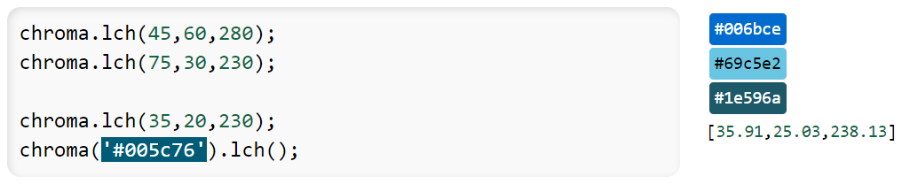

# Street Spirit contribution guidelines

## Cartography

### Purpose

Street Spirit aims to be a general purpose map style for OpenStreetMap data, suitable for
- use as a locator map,
- to show off what can be done with OpenStreetMap data,
- to be up-to-date with the latest OpenStreetMap data, and
- using to orient a viewer to a location they are at.

There is no ranking of these goals, and they may require compromises between the different goals. 

It does not seek to
- be a suitable style for overlaying complex data on,
- drive OpenStreetMap tagging practices, or
- be a replacement for maps with a specialized topic.

### Cartographic guidelines

As this style doesn't aim to have data overlayed on it, it can use all the available cartographic space. It does not need to avoid particular colours or symbols, except for icons that look like typical locators pins, as these might be used by locator maps, and would be confusing regardless.

This enables a wider range of colour and saturation than typical general-purpose web maps, more similar to topographic maps and atlases.

### Technical targets

We target Maplibre GL JS usage as part of a web-page that is either focused on the map, or has the map as part of a larger page. Usage across desktops, tablets, and phones is supported, with support for high-DPI displays. Smart watches and print are not targeted.

## Icons

- All icons must be SVG, saved as standards compliant SVG without any proprietary tags. In Inkscape software, you will need to "Save As..." and choose the format Optimized SVG (preferable) or Plain SVG.
- Use a common canvas size, which is usually 15x15 px.
- Align vectors to the pixel grid.
- Make a clean design, so reduced complexity where possible.

## Colours

Work out colours in the LCH colour space, because RGB and other non-perceptual colourspaces are hard to reason about.

The [chroma.js documentation](https://gka.github.io/chroma.js/) can function as a colour calculator.

### Hues

Use a consistent hue angle for a class of features. The following hue angles are used in this style

<table>
<thead>
<tr>
<th>Features</th>
<th>Hue</th>
</tr>
</thead>
<tbody>
<tr>
<td>Water</td>
<td style="background:#4cb7e1;color:black">240°</td>
</tr>
<tr>
<td>Transit</td>
<td style="background:#006bce;color:white">280°</td>
</tr>
<tr>
<td>Admin borders</td>
<td style="background:#c25eb8;color:black">330°</td>
</tr>
</tbody>
</table>

## Required technical knowledge

Contributing to the style requires some technical knowledge in the following areas

- [MapLibre GL style specification](https://maplibre.org/maplibre-gl-js-docs/style-spec/), focusing on layers and expressions, including data-driven expressions;
- YAML, in particular appropriate indentation for arrays. MapLibre GL styles tend to feature deeply nested arrays; and
- SQL for writing read-only PostGIS queries if modifying vector tiles.
